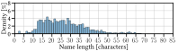
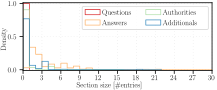

# Scripts to Plot the Empirical View on IoT DNS Traffic

This directory contains scripts to generate the plots seen in the paper from the CSV generated from
the scripts in [`03-dns-empirical/collect`](../collect). There
are 8 scripts:

- [`plot_iot_data_name_lens.py`](#plot_iot_data_name_lenspy) plots and logs the name lengths in
  the DNS traffic as depicted in Figure 1 of our paper.
- [`plot_iot_data_rr.py`](#plot_iot_data_rrpy) plots and logs the usage of resource records in
  the DNS traffic.
- [`plot_iot_data_sec_counts.py`](#plot_iot_data_sec_countspy) plots the number of entries in each
  section of messages in the DNS traffic.
- [`plot_iot_data_resp_lens.py`](#plot_iot_data_resp_lenspy) plots the response lengths in the DNS
  traffic.
- [`plot_iot_data_hostname_lens.py`](#plot_iot_data_hostname_lenspy) plots the hostname lengths
  (i.e. the name lengths excluding the top and second level domain) in the DNS traffic.
- [`plot_iot_data_cname.py`](#plot_iot_data_cnamepy) plots the lengths CNAME chains in the DNS
  traffic and provides those chains anonymized as [Graphviz dot] files.
- [`plot_iot_data_cname_dot.sh`](#plot_iot_data_cname_dotsh) can generate graphical output from
  the [Graphviz dot] files generated by [`plot_iot_data_cname.py`](#plot_iot_data_cnamepy).
- [`plot_iot_data_all.sh`](#plot_iot_data_allsh) calls and benchmarks selected scripts for all
  possible combinations of the IoT data sets ([IoTFinder], [MonIoTr], and [YourThings]) and the IXP
  data set.

## Requirements
You can skip the steps in this section if you are in the pre-configured vagrant VM.

The scripts all were tested on Ubuntu 22.04. While the scripts should be possible to run in other
operating systems (especially the Python scripts), we do not guarantee successful execution.
To run the commands described below, first run, e.g., `apt` on Ubuntu 22.04 to install dependencies:

```
sudo apt update
sudo apt install python3-pip python3-virtualenv
```

All commands in these instructions are assumed to be run from the [`03-dns-empirical/plot`](.)
directory.

All required python libraries are listed in [`requirements.txt`](./requirements.txt). They can be
installed using [pip] with the commands below.
We recommend installing them to a [Virtualenv] as shown, but it is not strictly necessary.

```sh
virtualenv env
. env/bin/activate
pip install -r requirements.txt
```

As the plots are rendered with LaTeX rendering, a LaTeX installation compatible with `matplotlib` is
required. For more information, please read [the `matplotlib` documentation][matplotlib usetex].

## Testing

The python scripts are tested for python versions 3.7 to 3.11 using [tox]. To test and lint the
code, run the following in this directory ([`03-dns-empirical/plot`](./)). If the python version
under test is installed, the tests for it will be executed.

```sh
tox
```

The [pytest] test cases can be found in the [`tests/`](./tests) directory.

## Input Parameter Naming

Each of the plotting python scripts takes one or more of the data sets as inputs. The IoT data sets
must (case-insensitive) either contain the names of the studies ([IoTFinder], [MonIoTr], and
[YourThings]) or their respective DOI, slashes (`/`) replaced with dashes (`-`), in their file name,
so the script can associate them. For the IXP data set use the name as provided by the
[`reformat_dns_week_2022_2.py`](../collect#reformat_dns_week_2022_2py) script. The
`./plot_iot_data_all.sh` script provides a convenient way to call all plotting scripts with the
expected names. See its `IOT_DATA_SRCS` and `IXP_DATA_SRCS` variables for examples for expected
names.

## Filters

Each of the plotting python scripts provides output for the data sets using different filters (if
the filter does not result in an empty set or a more restrictive filter does not result in the same
set):

- `all`: All sections of all DNS (incl. mDNS) messages.
- `qrys_only`: Only the question section of only DNS (incl. mDNS) queries.
- `qd_only`: Only the question section of all DNS (incl. mDNS) messages.
- `qd_an_only`: Only the question and answer sections of all DNS (incl. mDNS) messages.
- `no_mdns`: All sections of all DNS messages excluding mDNS messages.
- `no_mdns_qrys_only`: Only the question section of only DNS queries excluding mDNS queries.
- `no_mdns_qd_only`: Only the question section of only DNS messages excluding mDNS messages.
- `no_mdns_qd_an_only`: Only the question and answer sections of all DNS messages excluding mDNS
  messages.

Scripts might elect to exclude certain filters.
If referred to in plural in the text below, any filter that contains the filter as a substring is
implicitly also meant.

## [`plot_iot_data_name_lens.py`](./plot_iot_data_name_lens.py)

This script plots the lengths of all unique names for the DNS messages in the given data sets under
the given [filters] and stores them as SVG and PDF files in the directory defined by the `DATA_PATH`
environment variable (defaults to [`results`](../results)). It excludes, however,
the `qrys_only` filters for the [IoTFinder] data set and all filters but the `qrys_only` and
`qd_only` filters for the IXP data set. The plot for the `qd_only` filter with all IoT data sets and
the IXP data set were used for Figure 1 in the paper. In addition to plotting, it also adds a line
to the [`iot-data-name-lens-stats.csv`](../results/iot-data-name-lens-stats.csv) in `DATA_PATH` for
the given combination of data sets, which provides the statistical key properties in Table 3 of the
paper. See [Input Parameter Naming] for more information of the naming of the input parameters.

For more usage information use

```sh
./plot_iot_data_name_lens.py -h
```

An example of the output can be seen below:

<figure>
<p align="center">

</p>
<figcaption>
  <div align="center">
  Distribution of name lengths for IoT devices; names queried by different devices connected via the
  Internet.
  </div>
</figcaption>
</figure>

<figure>
<p align="center">

</p>
<figcaption>
  <div align="center">
  Distribution of name lengths at an IXP; names queried by different devices connected via the
  Internet.
  </div>
</figcaption>
</figure>

## [`plot_iot_data_rr.py`](./plot_iot_data_rr.py)

This script plots the resource record usage for the DNS messages in the given data sets under the
given [filters] and as pie charts and stores them as SVG and PDF files in the directory defined by
the `DATA_PATH` environment variable (defaults to [`results`](../results)). It excludes, however,
all `no_mdns` filters for the IXP data set and the `qrys_only` filters for the [IoTFinder] data
set. All resource records for which the usage rate is under 1% are summarized to "Others" in the
plots, however, their percentages are added to the
[`iot-data-rr-others.yaml`](../results/iot-data-rr-others.yaml) file in `DATA_PATH`.
Together, the plots and the listings in the YAML file, form the basis for Table 4 in the paper. See
[Input Parameter Naming] for more information of the naming of the input parameters.


For more usage information use

```sh
./plot_iot_data_rr.py -h
```

An example of the output can be seen below:

<figure>
<p align="center">

</p>
<figcaption>
  <div align="center">
  Queried record types in `IN` class at IoT devices.
  </div>
</figcaption>
</figure>

<figure>
<p align="center">

</p>
<figcaption>
  <div align="center">
  Queried record types in `IN` class at an IXP.
  </div>
</figcaption>
</figure>


## [`plot_iot_data_sec_counts.py`](./plot_iot_data_sec_counts.py)

This script plots the number of entries of each section for the DNS messages in the given data sets
under the given [filters] and stores them as SVG and PDF files in the directory defined by the
`DATA_PATH` environment variable (defaults to [`results`](../results)). Consequently, it only uses
the `all` and `no_mdns` filters for the IoT data sets and only the `all` filter for the IXP data
set. See [Input Parameter Naming] for more information of the naming of the input parameters.

For more usage information use

```sh
./plot_iot_data_sec_counts.py -h
```

An example of the output can be seen below:

<figure>
<p align="center">

</p>
<figcaption>
  <div align="center">
  Distribution of section lengths in DNS messages for IoT devices by different devices connected via
  the Internet.
  </div>
</figcaption>
</figure>

<figure>
<p align="center">

</p>
<figcaption>
  <div align="center">
  Distribution of section lengths in DNS message at an IXP by different devices connected via the
  Internet.
  </div>
</figcaption>
</figure>

## [`plot_iot_data_resp_lens.py`](./plot_iot_data_resp_lens.py)

This script plots the length of the DNS responses in the given data sets under the given [filters]
and stores them as SVG and PDF files in the directory defined by the `DATA_PATH` environment
variable (defaults to [`results`](../results)). Only the `qd_only` and `all` filter is used, for the
IXP data set, the `all` filter is also excluded. For a better overview, the plots are capped at 1500
bytes of response length.  If a message is longer than 1500 bytes, a warning is printed during the
script execution. See [Input Parameter Naming] for more information of the naming of the input
parameters.

For more usage information use

```sh
./plot_iot_data_resp_lens.py -h
```

An example of the output can be seen below:

<figure>
<p align="center">

</p>
<figcaption>
  <div align="center">
  Distribution of response lengths for IoT devices queried by different devices connected via the
  Internet.
  </div>
</figcaption>
</figure>

<figure>
<p align="center">

</p>
<figcaption>
  <div align="center">
  Distribution of response lengths at an IXP queried by different devices connected via the
  Internet.
  </div>
</figcaption>
</figure>

## [`plot_iot_data_hostname_lens.py`](./plot_iot_data_hostname_lens.py)

This script plots the lengths of all unique hostnames, meaning the names minus top and second level
domains, for the DNS messages in the given IoT data sets under the given [filters] and stores them
as SVG and PDF files in the directory defined by the `DATA_PATH` environment variable (defaults to
[`results`](../results)). The `qrys_only` filters are excluded for the `IoTFinder`. A slightly
modified version of the `get_tld()` function of the [publicsuffix2] library is used to extract the
top and second level domains (see `extract_hostname()` function script). See [Input Parameter
Naming] for more information of the naming of the input parameters.

For more usage information use

```sh
./plot_iot_data_hostname_lens.py -h
```

## [`plot_iot_data_cname.py`](./plot_iot_data_cname.py)

This script plots the lengths of CNAME chains in all DNS messages in the given IoT data sets under
the given [filters] and stores them as SVG and PDF files in the directory defined by the `DATA_PATH`
environment variable (defaults to [`results`](../results)). The `qd_an_only` and `no_mdns` filters
are excluded for all data sets and the `qrys_only` filters for the `IoTFinder` data set. In
addition, it generates a graph of the anonymized CNAME chains in the [Graphviz dot] format in
`DATA_PATH`. See [Input Parameter Naming] for more information of the naming of the input
parameters.
For more usage information use

```sh
./plot_iot_data_cname.py -h
```

An example of the output can be seen below and in
[`iot-data-cname-chains-all@iotfinder+yourthings+moniotr.dot`](../results/iot-data-cname-chains-all@iotfinder+yourthings+moniotr.dot):

<figure>
<p align="center">

</p>
<figcaption>
  <div align="center">
  Distribution of CNAME chain length for IoT devices queried by different devices connected via the
  Internet.
  </div>
</figcaption>
</figure>

## [`plot_iot_data_cname_dot.sh`](./plot_iot_data_cname_dot.sh)

This script generates a plot in the desired output format (default SVG) from the [Graphviz dot]
files generated by `plot_iot_data_cname.py`. It expects a dot file as input and outputs to the same
name of the input, but the `.dot` extension being replaced with the extension of the output format.

For more usage information use

```sh
./plot_iot_data_cname_dot.sh
```

## [`plot_iot_data_all.sh`](./plot_iot_data_all.sh)

This script calls and benchmarks the following scripts for all possible combinations of the IoT data
sets ([IoTFinder], [MonIoTr], and [YourThings]) and the IXP data set:

- [`plot_iot_data_name_lens.py`](#plot_iot_data_name_lenspy)
- [`plot_iot_data_rr.py`](#plot_iot_data_rrpy)
- [`plot_iot_data_sec_counts.py`](#plot_iot_data_sec_countspy)
- [`plot_iot_data_resp_lens.py`](#plot_iot_data_resp_lenspy)
- [`plot_iot_data_cname.py`](#plot_iot_data_cnamepy) (but only for the IoT data sets)

It expects no input parameters.

[YourThings]: https://yourthings.info/data/#yourthings-data
[IoTFinder]: https://yourthings.info/data/#iotfinder-data
[MonIoTr]: https://moniotrlab.ccis.neu.edu/imc19/
[Graphviz dot]: https://www.graphviz.org/
[pip]: https://pip.pypa.io
[tox]: https://tox.wiki
[pytest]: https://docs.pytest.org
[Virtualenv]: https://virtualenv.pypa.io
[matplotlib usetex]: https://matplotlib.org/stable/tutorials/text/usetex.html
[filters]: #filters
[Input Parameter Naming]: #input-parameter-naming
[publicsuffix2]: https://github.com/nexb/python-publicsuffix2
