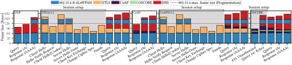
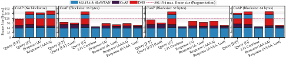
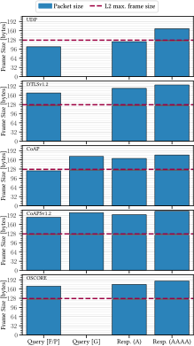
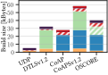
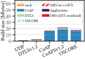
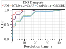
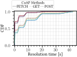
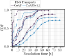
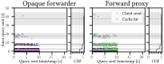

# Scripts to process and plot experiments results
## Overview
The scripts in this directory serve the processing and plotting of the experiment results as
described in Section 6 _Comparison of Low-power Transports_ and Section 7 _Evaluation of Caching for
  DoC_.

- `parse_baseline_results.py`: Parses the logs of [`baseline` experiments][experiment types] and
  reformats them to CSV tables.
- `parse_comp_results.py`: Parses the logs of [`comp` experiments][experiment types] and reformats
  them to CSV tables.
- `parse_max_age_results.py`: Parses the logs of [`max_age` experiments][experiment types] and
  reformats them to CSV tables.
- `parse_max_age_link_util.py`: Parses the PCAP files of [`max_age` experiments][experiment types]
  for link utilization and stores the results in
  [`doc-eval-max_age-link_utilization.csv`](../../results/doc-eval-max_age-link_utilization.csv) in
  the results directory.
- `collect_build_sizes.py`: Builds the [DoC client] and parses out the build sizes for a selection
  of its modules under different compile time configurations.
- `plot_common.py`: Base module for all plotting (`plot_*.py`) scripts.
- `plot_pkt_sizes.py`: Plots the link layer packet sizes of the different message types seen in our
  [`comp` experiments][experiment types] as depicted in Figure 7 in our paper.
- `plot_pkt_sizes_coap.py`: Plots the link layer packet sizes of the different message types seen in
  our [`comp` experiments][experiment types] when using block-wise or GET method as depicted in
  Figure 13 in our paper.
- `plot_pkt_sizes_hypo.py`: Plots the link layer packet sizes of the different message types similar
  to Figure 7 in our paper for different hypothetical packet headers in the lower layers and based
  on the key statistical values for name lengths in DNS from Section 3 of our paper.
- `plot_pkt_sizes_slides.py`: Plots the link layer packet sizes of the different message types seen
  in our [`comp` experiments][experiment types] similar to Figure 7 in our paper but split up for
  slide decks that compare the packet sizes to the resolution time CDFs generated with
  `plot_comp_cdf.py`.
- `plot_build_sizes.py`: Using the output of `collect_build_sizes.py` it plots the build sizes of
  the different compile-time configurations for the [DoC client] as depicted in Figure 8 of our
  paper.
- `plot_baseline.py`: Plots DNS query timestamp to resolution time, similar to Figure 2 in
  [An Empirical Study of the Cost of DNS-over-HTTPS by Böttger et al.][10.1145/3355369.3355575] for
  the [`baseline` experiments][experiment types].
- `plot_baseline_trans.py`: Plots a transmission graph with the DNS query timestamp to event time
  offset to DNS query, similar to Figure 12 in our paper for the
  [`baseline` experiments][experiment types].
- `plot_comp_cdf.py`: Plots the resolution time CDFs for the non-blockwise [`comp`
  experiments][experiment types] as depicted in Figure 9 in our paper.
- `plot_comp_cdf_blockwise.py`: Plots the resolution time CDFs for for block-wise runs of the
  [`comp` experiments][experiment types] as depicted in Figure 10 in our paper.
- `plot_comp_trans.py`: Plots a transmission graph with the DNS query timestamp to event time
  offset to DNS query, similar to Figure 12 in our paper for the [`comp` experiments][experiment
  types].
- `plot_max_age_cdf.py`: Plots the resolution time CDFs for the [`max_age` experiments][experiment
  types], similar to Figures 9 and 10 in our paper.
- `plot_max_age_link_util.py`: Plots a link utilization plot with distance to sink to bytes and L2
  frames, respectively, similar to Figure 11 in our paper for [`max_age` experiments][experiment
  types].
- `plot_max_age_trans.py`: Plots a transmission graph with the DNS query timestamp to event time
  offset to DNS query, as dipicted in Figure 12 in our paper for the [`max_age`
  experiments][experiment types].
- `plot_done.py`: Plots a matrix of all possible and required experiment run configurations and
  how many of each are still missing for the full set of 10 runs.
- `plot_all.sh`: Calls all `plot_*.py` scripts for plots that are provided in our paper.
- The `tests/` directory contains [pytest]-based tests for the python scripts in this directory.

## Requirements

The scripts were all tested on Ubuntu 22.04. While the scripts should be possible to run in other
operating systems (especially the Python scripts), we do not guarantee successful execution.

All required python libraries are listed in [`requirements.txt`](./requirements.txt). They can be
installed using [pip] with the commands below.
We recommend installing them to a [Virtualenv] as shown, but it is not strictly necessary.

```sh
virtualenv env
. env/bin/activate
pip install -r requirements.txt
```

[Tshark] is required for the PCAP parsing.

As the plots are rendered with LaTeX rendering, a LaTeX installation compatible with `matplotlib` is
required. For more information, please read [the `matplotlib` documentation][matplotlib usetex].

## Testing

The python scripts are tested for python versions 3.7 to 3.11 using [tox]. To test and lint the
code, run the following in this directory ([`06-07-evaluation/scripts/plots`](./)). If the python
version under test is installed, the tests for it will be executed.

```sh
tox
```

## Usage and results

For all scripts the environment variable `DATA_PATH` can be used to change their in- and output
path. The default is [`06-07-evaluation/results/`](./../../results).

Most of the `./plot_*.py` scripts can be provided a `mplstyle` style sheet using the `-s` argument.
See [matplotlib documentation][mplstyle] for more information.

The `-h` flag can be used on all python scripts to gain more insights on the arguments that can be
provided, e.g.

```
./plot_pkt_sizes.py -h
```

### `parse_*_results.py`

The scripts `parse_baseline_results.py`, `parse_comp_results.py`, and `parse_max_age_results.py` can
be used to parse the log files generated by the dispatch scripts in
[`06-07-evaluation/scripts/exp_ctrl`](./../exp_ctrl) into CSV files usable for the plotting
`plot_*.py` scripts. They take the log files from `DATA_PATH` and generate for each log `<name>.log`
a `<name>.times.csv` and a `<name>.stats.csv` from the application output in `DATA_PATH`.

`<name>.times.csv` contains various event timings in relation to a query sent. Depending on the
experiment type, it contains up to 10 columns:

- `transport` notes the DNS transport used.
- `node` notes the FIT IoT-Lab node the query was sent from.
- `id` notes the ID of the DNS query (i.e. the first five characters of the name).
- `query_time` notes the time as a UNIX timestamp the query was sent.
- `response_time` notes the time as a UNIX timestamp the response to the query was received. If
  there was no response, the column is empty.
- `transmission_ids` notes the various IDs the DNS transport uses as a Python list for the query and
  its response.
- `transmissions` notes the times as a Python list of UNIX timestamps the DNS transport sent a
  message containing the query.
- `dns_cache_hits` notes the times as a Python list of UNIX timestamps a DNS cache hit happened for
  the DNS query. If there was no cache hit, the column is empty.
- `cache_hits` notes the times as a Python list of UNIX timestamps when a CoAP cache hit happened at
  the CoAP forward proxy for the DNS query or if a CoAP cache entry was re-validated due to the DNS
  query. If there was no cache hit and no cache validation happened, the column is empty.
- `client_cache_hits` notes the times as a Python list of UNIX timestamps when a CoAP cache hit
  happened at the DoC client for the DNS query or if a CoAP cache entry was re-validated due to the
  DNS query. If there was no cache hit and no cache validation happened, the column is empty.

An example of such a CSV file can be found in
[`doc-eval-proxy-ieee802154-udp-proxied0-None-None-50x5.0-A-297517-1645826017.times.csv`](../../results/doc-eval-proxy-ieee802154-udp-proxied0-None-None-50x5.0-A-297517-1645826017.times.csv)

`<name>.stats.csv` contains link layer statistics collected by the application on the node after an
experiment run. Those were not used in the paper for any plots in the end (we used externally
sniffed PCAP dumps to analyze the link utilization), but they were kept for completeness. They
contain 6 columns:

- `node` notes the FIT IoT-Lab node the stats were taken from.
- `l2_sent` notes the number of link-layer packets sent from `node` during the experiment run.
- `l2_received` notes the number of link-layer packets received at `node` during the experiment run.
- `l2_success` notes the number of successfully transmitted link-layer packets from `node` during
  the experiment run.
- `l2_multicast` notes the number of multicast or broadcast link-layer packets from `node` during
  the experiment run.
- `l2_error` notes the number of unsuccessfully transmitted link-layer packets from `node` during
  the experiment run.

An example of such a CSV file can be found in
[`doc-eval-proxy-ieee802154-udp-proxied0-None-None-50x5.0-A-297517-1645826017.stats.csv`](../../results/doc-eval-proxy-ieee802154-udp-proxied0-None-None-50x5.0-A-297517-1645826017.stats.csv)

You can change the verbosity of the output of the script using the `-v <log level>` argument. See
e.g.

```sh
./parse_baseline_results.py -h
```

for more information.

### [`parse_max_age_link_util.py`](./parse_max_age_link_util.py)

This script uses [Tshark] to generate a
[`doc-eval-max_age-link_utilization.csv`](../../results/doc-eval-max_age-link_utilization.csv) in
`DATA_PATH` from all PCAP files in `DATA_PATH` collected during the [`max_age`][experiment types].

It requires the sink and each link used during the experiment as a pair-wise list of nodes as
arguments, as this information can not be found in the PCAP file.
E.g.

```sh
./parse_max_age_link_util.py 209 209,205 205,202 205,290
```

For more information use

```sh
./parse_max_age_link_util.py -h
```

The output CSV file contains the following columns:

- `exp_timestamp` notes the time as a UNIX timestamp when the experiment was started.
- `max_age_config` notes the caching approach used for the experiment, `dohlike` for _DoH-like_ and
  `eolttls` for `EOL TTLs`.
- `method` notes the CoAP method used during the experiment.
- `dns_cache` notes if a DNS cache was used for the experiment. 0 means no DNS cache was used, 1
  means that the DoC clients used a DNS cache.
- `client_coap_cache` notes if a CoAP cache was used at the DoC clients for the experiment. 0 means
  no CoAP cache was used, 1 means that the DoC clients used a CoAP cache.
- `proxied` notes that a caching CoAP forward proxy was used for the experiments. 0 means the
  intermediate node acted as a opaque IPv6 forwarder, 1 means it acted as a caching CoAP forward
  proxy.
- `node` notes the number in the name of the M3 node in the FIT IoT LAB for which the link
  utilization is was gathered in this row.
- `distance` notes the distance of node identified by `node` to the border router in hops.
- `queries_bytes` notes the number of bytes used on the link layer by queries for the node
  identified by `node`.
- `queries_packets` notes the number of packets used on the link layer by queries for the node
  identified by `node`.
- `queries_frags` notes the number of 6LoWPAN fragments used on the link layer by queries for the
  node identified by `node`.
- `responses_bytes` notes the number of bytes used on the link layer by responses to the node
  identified by `node`.
- `responses_packets` notes the number of packets used on the link layer by responses to the node
  identified by `node`.
- `responses_frags` notes the number of 6LoWPAN fragments used on the link layer by responses to the
  node identified by `node`.

### [`collect_build_sizes.py`](./collect_build_sizes.py)

This script uses `make cosy` of RIOT to generate a  `doc-eval-build-sizes-<transport>.json` in
`DATA_PATH` for each DNS transport (`coap` and `coaps` with and without GET method support).
It takes the output of the `make cosy` command for the [DoC client application][DoC client] with
the `COSY_NO_WEBSERVER=1` for the different compile-time configurations for `obj`, `size`, `sym`,
and `type` symbols and transforms it into parsable JSON. An example output can be seen in
[`doc-eval-build-sizes-udp.json`](./../../results/doc-eval-build-sizes-udp.json).

### [`plot_pkt_sizes.py`](./plot_pkt_sizes.py)

This script plots the link layer packet sizes of the different message types seen in our
[`comp` experiments][experiment types] as depicted in Figure 7 in our paper and stores the plots as
SVG and PDF files in `DATAPATH`. It excludes, however, CoAP packets that were transferred block-wise
and those that used the GET and POST method. We have
[`plot_pkt_sizes_coap.py`](#plot_pkt_sizes_coappy) for that.

An example of the output can be seen below:

<figure>
<p align="center">

</p>
<figcaption>
  <div align="center">
  Maximum link layer packet sizes for each transport when resolving the name
  XXXXX.id.exp.example.org (24 characters) for a single record (A or AAAA respectively).
  </div>
</figcaption>
</figure>

### [`plot_pkt_sizes_coap.py`](./plot_pkt_sizes_coap.py)

This script plots the link layer packet sizes of the different message types seen in
our [`comp` experiments][experiment types] when using block-wise or GET method as depicted in
Figure 13 in our paper and stores the plots as SVG and PDF files in `DATAPATH`.

An example of the output can be seen below:

<figure>
<p align="center">

</p>
<figcaption>
  <div align="center">
  Maximum link layer packet sizes for each transport for the resolution of name
  XXXXX.id.exp.example.org (24 characters) for a single record (A and AAAA respectively) for
  different CoAP methods (F = FETCH, G = GET, P = POST) and block sizes. “Last” denotes the size of
  the last block with block-wise transfer.
  </div>
</figcaption>
</figure>

### [`plot_pkt_sizes_hypo.py`](./plot_pkt_sizes_hypo.py)

This script plots the link layer packet sizes of the different message types similar
to Figure 7 in our paper for different hypothetical packet headers in the lower layers and based
on the key statistical values for name lengths in DNS from Section 3 of our paper and stores the
plots as SVG and PDF files in `DATAPATH`.
It assumes different header formats, e.g., with IEEE 802.15.4 long address or short addresses,
with and without IEEE 802.15.4 security headers, different CoAP header compositions, different URI
paths, and plots them for the minimum, median, mean, and maximum name lengths observed in Section 3
of our paper.

### [`plot_pkt_sizes_slides.py`](./plot_pkt_sizes_slides.py)
This script plots the link layer packet sizes of the different message types seen
in our [`comp` experiments][experiment types] similar to Figure 7 in our paper and stores the plots
as SVG and PDF files in `DATAPATH`. In contrast to [`plot_pkt_sizes.py`](#plot_pkt_sizespy), it
splits up for slide decks that compare the packet sizes directly to the resolution time CDFs
generated with [`plot_comp_cdf.py`](#plot_comp_cdfpy). It also does not show the different layers of
the packet.

<figure>
<p align="center">

</p>
<figcaption>
  <div align="center">
  Maximum link layer packet sizes for each transport when resolving the name
  XXXXX.id.exp.example.org (24 characters) for a single record (A or AAAA respectively).
  </div>
</figcaption>
</figure>


### [`plot_build_sizes.py`](./plot_build_sizes.py)

This script plots the build sizes based on the resulting `doc-eval-build-sizes-<transport>.json`s of
the [`collect_build_sizes.py`](#collect_build_sizespy) script as depicted in Figure 8 of our paper
and stores the plots as SVG and PDF files in `DATAPATH`.

Examples of the output can be seen below:

<figure>
<p align="center">

</p>
<figcaption>
  <div align="center">
  ROM memory consumption of each DNS transport.
  </div>
</figcaption>
</figure>

<figure>
<p align="center">

</p>
<figcaption>
  <div align="center">
  RAM memory consumption of each DNS transport.
  </div>
</figcaption>
</figure>

### [`plot_baseline.py`](./plot_baseline.py)

This script plots query sent events to the resolution time each query took for [`baseline`
experiments][experiment types] similar to Figure 2 of the following paper:

Timm Böttger, Felix Cuadrado, Gianni Antichi, Eder Leão Fernandes, Gareth Tyson, Ignacio Castro, and
Steve Uhlig. 2019. An Empirical Study of the Cost of DNS-over-HTTPS. In _Proceedings of the Internet
Measurement Conference (IMC '19)_. Association for Computing Machinery, New York, NY, USA, 15–21.
https://doi.org/10.1145/3355369.3355575

It stores the plots as SVG and PDF files in `DATAPATH`.

Examples of the output can be seen below:

<figure>
<p align="center">

</p>
<figcaption>
  <div align="center">
   Impact of head-of-line-blocking on resolution times for a DNS A query over different transport
   protocols. The upper row depict the baseline and the lower ones the effect of a delay (1s
   every 25 queries). The 10 runs of each scenario are superimposed over each other.
  </div>
</figcaption>
</figure>

<figure>
<p align="center">

</p>
<figcaption>
  <div align="center">
   Impact of head-of-line-blocking on resolution times for a DNS AAAA query over different transport
   protocols. The upper row depict the baseline and the lower ones the effect of a delay (1s
   every 25 queries). The 10 runs of each scenario are superimposed over each other.
  </div>
</figcaption>
</figure>

### [`plot_baseline_trans.py`](./plot_baseline_trans.py)
This plots a transmission graph with the DNS query timestamp to event time offset to DNS query,
similar to Figure 12 in our paper for the [`baseline` experiments][experiment types] and stores the
plots as SVG and PDF files in `DATAPATH`.

An example of the output can be seen below:

<figure>
<p align="center">

</p>
<figcaption>
  <div align="center">
   CoAPSv1.2 GET events of message (re-)transmissions at the client (blue) compared to the time of
   the initial DNS AAAA query. Retransmissions follow an exponential back- off and scatter within
   specific (gray) areas. Size and opacity of each marker represent the multiplicity of events in
   the same area. On the right, the density of the events is plotted as a rotated CDF (x- and y-axis
   swapped).
  </div>
</figcaption>
</figure>

### [`plot_comp_cdf.py`](./plot_comp_cdf.py)
This plots the resolution time CDFs for the non-blockwise [`comp` experiments][experiment types] as
depicted in Figure 9 in our paper and stores the plots as SVG and PDF files in `DATAPATH`.

Examples of the output can be seen below:

<figure>
<p align="center">

</p>
<figcaption>
  <div align="center">
   Resolution times for 50 A record queries (Poisson distributed with 𝜆 = 5 queries/s).
  </div>
</figcaption>
</figure>

<figure>
<p align="center">

</p>
<figcaption>
  <div align="center">
   Resolution times for 50 AAAA record queries (Poisson distributed with 𝜆 = 5 queries/s).
  </div>
</figcaption>
</figure>

### [`plot_comp_cdf_blockwise.py`](./plot_comp_cdf_blockwise.py)
This plots the resolution time CDFs for for block-wise runs of the [`comp` experiments][experiment
types] as depicted in Figure 10 in our paper and stores the plots as SVG and PDF files in
`DATAPATH`.

Examples of the output can be seen below:

<figure>
<p align="center">

</p>
<figcaption>
  <div align="center">
   Resolution times for 50 A record queries using FETCH with block-wise transfer.
  </div>
</figcaption>
</figure>

<figure>
<p align="center">

</p>
<figcaption>
  <div align="center">
   Resolution times for 50 AAAA record queries using FETCH with block-wise transfer. Note, that
   block size 64 was only used with AAAA records, as DNS responses for A record stay below 64 bytes
   in size.
  </div>
</figcaption>
</figure>

### [`plot_comp_trans.py`](./plot_comp_trans.py)
This plots a transmission graph with the DNS query timestamp to event time offset to DNS query,
similar to Figure 12 in our paper for the [`comp` experiments][experiment types] and stores the
plots as SVG and PDF files in `DATAPATH`.

An example of the output can be seen below:

<figure>
<p align="center">

</p>
<figcaption>
  <div align="center">
   CoAP FETCH events of message (re-)transmissions at the client compared to the time of the initial
   DNS AAAA record query for over an opaque forwarder (left) and having a caching forward proxy
   (right). Retransmissions follow an exponential back- off and scatter within specific (gray)
   areas. Size and opacity of each marker represent the multiplicity of events in the same area. On
   Right to each sub-plot, the density of the events is plotted as a rotated CDF (x- and y-axis
   swapped).
  </div>
</figcaption>
</figure>

### [`plot_max_age_cdf.py`](./plot_max_age_cdf.py)
### [`plot_max_age_link_util.py`](./plot_max_age_link_util.py)
### [`plot_max_age_trans.py`](./plot_max_age_trans.py)
### [`plot_done.py`](./plot_done.py)
### [`plot_all.sh`](./plot_all.sh)

[experiment types]: ./../exp_ctrl/#experiment-types
[DoC client]: ./../../apps/requester
[10.1145/3355369.3355575]: https://doi.org/10.1145/3355369.3355575
[pytest]: https://pytest.org
[pip]: https://pip.pypa.io
[Virtualenv]: https://virtualenv.pypa.io
[Tshark]: https://tshark.dev
[matplotlib usetex]: https://matplotlib.org/stable/tutorials/text/usetex.html
[mplstyle]: https://matplotlib.org/stable/tutorials/introductory/customizing.html
[tox]: https://tox.wiki
